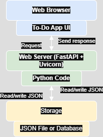

# Todos
# todo-app
 It allows to perform CRUD operations (Create, Read, Update, Delete) on todo list, all stored in a local JSON file for data persistence.

**Features**

- Show All Todos: View a list of all the todos you have.
- Add New Todo: Add new todos by specifying the title, description, and completion status.
- Get Todo by ID: Retrieve a specific todo using its unique ID.
- Update a Todo: Edit the title, description, or status of an existing todo.
- Delete a Todo: Remove a todo by providing its ID.

## Prerequisites

- Python 3.1
- No external libraries are required; only the built-in `json`, `os`, and `uuid` libraries are used.

## Setup Instructions

1. **Clone the repository**:

   ```bash
   git clone https://github.com/your-username/todo-management.git
   cd todo-management
   ```

2. **Run the application**:

   ```bash
   python main.py
   ```

## Todo Data Storage

The todos are stored in a JSON file located at `data/todos.json`. Each todo is represented by a dictionary with the following fields:

- `id`: A unique identifier for the todo (generated using UUID).
- `title`: The name or title of the todo.
- `description`: A brief description of the todo.
- `doneStatus`: A boolean (True/False) indicating if the todo has been completed.
<<<<<<< HEAD

##  Architecture Diagram




=======
>>>>>>> 7a4207825aaaaf9dc0af79112147eebae8680b55
